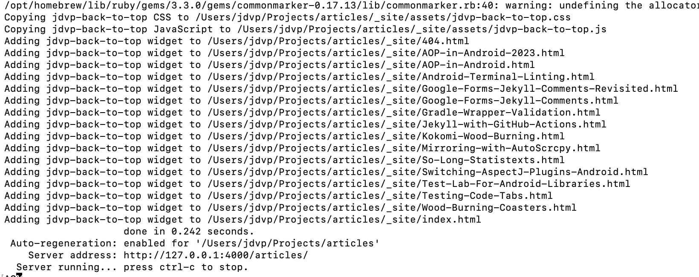

## jdvp-back-to-top 

[](https://badge.fury.io/rb/jdvp-back-to-top)

This Jekyll plugin is basically a wrapper around [vanilla-back-to-top] that adds a simple back-to-top widget to a Jekyll static site. The styling is changed slightly (see below) as the intent of the plugin is to be used for my own sites so that I can more easily add and remove to multiple personal sites as desired.

## Installation

Add the jdvp-back-to-top gem inside of your `Gemfile`:

```ruby
group :jekyll_plugins do
  gem 'jdvp-back-to-top'
end
```

If necessary, run bundle install to install the missing gem:

```sh
bundle install
```

That's it! By default the styling for the widget will be as shown in the video below and will be added to any HTML page in your site when you next run your build.

You can see this plugin in action on [my own personal site].

| jdvp-back-to-top functionality |
|-----------------------|
|  |

## Configuration

If you don't like the default look & feel or want to change the files that the widget is added to, you can do that using the following configuration options in your site's `_config.yml`

### File Pattern

To change the files that widget is added to, you can use the following configuration option

```yaml
jdvp_back_to_top:
  file_pattern: "**/*.html"
```

This file pattern is used to search in the generated site's top-level directory and under the hood uses [Dir.glob] so you might check their docs if you need help with figuring out what pattern to use. 

The default file pattern that is used is `"**/*.html"` which should add the widget to every html page in your generated site. (Caveat: This plugin actually only adds to HTML pages that have a properly ending body or html tag)

### Debug logging

Related to the above, you can enable debug logging via the following configuration option

```yaml
jdvp_back_to_top:
  debug_logging: true
```

This accepts `true` or `false` as an argument and when enabled prints which files are being added or updated in the generated site, as shown in the example image below. By default, this value is `false`

| debug_logging enabled example |
|-----------------------|
|  |

### Styling Options

By default, this plugin provides styling for the widget both via CSS and the [vanilla-back-to-top styling options]. You might be able to accomplish what you want by overriding the provided CSS which uses an id for the widget: `#jdvp-back-to-top`.

If you are unable to get the look you want that way, want to play around with the styling more, or just want more control, you can override the vanilla-back-to-top options directly in your site's `_config.yml`

```yaml
jdvp_back_to_top:
  options: "{ id: 'jdvp-back-to-top', backgroundColor: '#FFF', textColor: '#000',cornerOffset: 20 }"
```

This is the same JS object that is documented in the [vanilla-back-to-top styling options]. Note that you can use any `id` you want, but if you don't use `jdvp-back-to-top`, the CSS provided by this plugin by default will not be applied (which may be desireable for you anyway). Also keep in mind that the entire object needs to be within added to the `_config.yml` as a String.

By default the value for this configuration is as follows (pretty-printed for clarity)

```javascript
{
  id: 'back-to-top',
  backgroundColor: '#FFF',
  textColor: '#000',
  innerHTML: '<svg style="margin: 0px;"><path d="M4 12l1.41 1.41L11 7.83V20h2V7.83l5.58 5.59L20 12l-8-8-8 8z"/></svg>',
  cornerOffset: 20
}
```

[vanilla-back-to-top]: https://github.com/vfeskov/vanilla-back-to-top
[my own personal site]: https://jdvp.me/articles/
[Dir.glob]: https://ruby-doc.org/core-2.6.3/Dir.html#method-c-glob
[back-to-top styling options]: https://github.com/vfeskov/vanilla-back-to-top/blob/v7.2.1/OPTIONS.md
